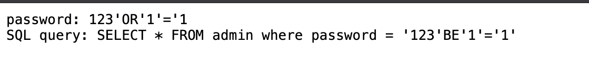

## 
## Web EX:
### Challenge : Irish-Name-Repo 1
There is a website running at https://jupiter.challenges.picoctf.org/problem/33850/ (link) or http://jupiter.challenges.picoctf.org:33850. Do you think you can log us in? Try to see if you can login!
### Solving :
Leanred some basics of SQL injection [Specifically OR payload and Comment(--) Payload] inorder to solve thi9s question.We get the flag if we enter the line below as the username
```
admin' -- 
```
since the sql query would treat the line after -- as a comment ,we were logged in and got the flag .Or we could also enter 
```
admin' OR '1'='1
```
even this gives the flag.Since there is porbably a and statement inorder to verify both username and password .AND has a higher precedence than OR,So first the AND statement is checked and returns false and then OR is checked which returns TRUE therefore we log in .  
Note :This is possible since the username of admin in the DB is admin ,if a name match isnt found we wouldnt be logged in .  

### Flag:picoCTF{s0m3_SQL_f8adf3fb}

### Challenge : Irish-Name-Repo 2
There is a website running at https://jupiter.challenges.picoctf.org/problem/52849/ (link). Someone has bypassed the login before, and now it's being strengthened. Try to see if you can still login! or http://jupiter.challenges.picoctf.org:52849

### Solving :
When i re ran the commands from the previous problem it worked for the Command payload but failed for the OR payload.
```
admin' OR '1'='1
# OUTPUT : SQLi detected
```
```
admin' -- 
# Logged in succesfully
```

### Flag :picoCTF{m0R3_SQL_plz_fa983901}

### Challenge :Irish-Name-Repo 3
There is a secure website running at https://jupiter.challenges.picoctf.org/problem/54253/ (link) or http://jupiter.challenges.picoctf.org:54253. Try to see if you can login as admin!
### Solving :
Since there was only a password field ,the command payload wouldnt work.I used the OR payload and the site crashed .After some searching i noticed that there was a hidden inout feield that passes debug paramter on submitting the form .So when i changed it from 0 to 1 and submitting i got the following

So the debug value just provides database query.So i ran the previous commmand of OR by replacing it with BE and got the flag
```
123' BE '1'='1'
```
### Flag : picoCTF{3v3n_m0r3_SQL_7f5767f6}

### Challenge :