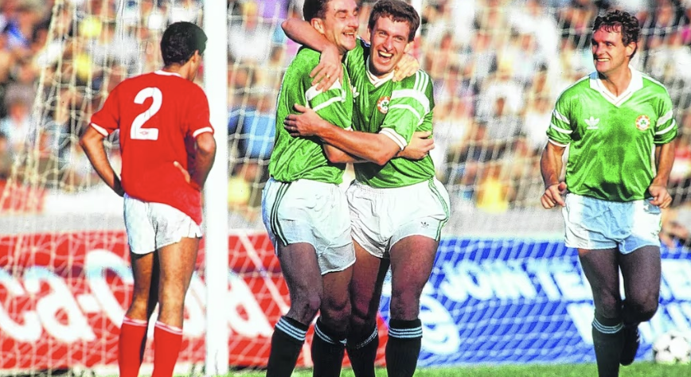

# Challenges!
## OSINT :
### Description :
While visiting this place, he took a photo and watched a movie running in theatres that inspired him during his stay. His friends casually called him the 'movie guy' due to his love for films, which complements his interest in other forms of art and literature.

### Solving :
    After image search i found this image is of the match between Northern Ireland and Wales and was captured by Billy Stickland/ALLSPORT on 15 NOV 1989.The venue was Ta' Qali National Stadium, Malta.
    https://www.gettyimages.in/detail/news-photo/mandatory-credit-billy-stickland-allsport-news-photo/72375330?adppopup=true
    After going through wikipedia page of movies in malta i found Erik the Viking and Leviathan was in the theatres during this time.There was a higher chance of Leviathan than eric the viking having a impact rather than eri the viking therefore 9_1989 is the flag .
### Flag : 9_1989

## 